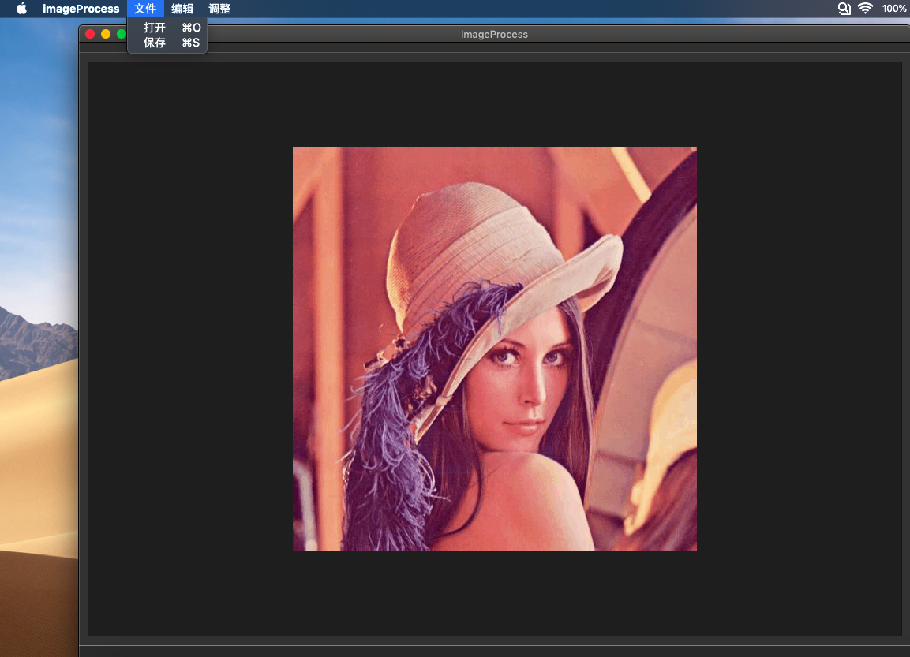

# 刘韧的个人报告

## 目录
- [刘韧的个人报告](#刘韧的个人报告)
    - [分工任务](#分工任务)
        - [第0轮迭代](#第0轮迭代)
            - [设计思路](#第0轮迭代)
            - [解决方案](#第0轮迭代)
            - [运行效果图](#第0轮迭代)
        - [第1轮迭代](#第1轮迭代)
            - [设计思路](#第1轮迭代)
            - [解决方案](#第1轮迭代)
            - [运行效果图](#第1轮迭代)
        - [第2轮迭代](#第2轮迭代)
            - [设计思路](#第2轮迭代)
            - [解决方案](#第2轮迭代)
        - [第3轮迭代](#第3轮迭代)
            - [设计思路](#第3轮迭代)
            - [解决方案](#第3轮迭代)
            - [运行效果图](#第3轮迭代)
    - [心得体会](#心得体会)
    - [课程建议](#课程建议)


## 分工任务

- 我是本项目的组员之一，在本项目的过程中，我主要负责了项目的扩展内容的部分。
- 在第0轮迭代中，我负责开启了项目的github仓库，并将每个组员的列为这个项目的开发者，并编辑了项目的第一个ReadMe文件。同时，我对项目完成了对持续集成技术的最初探索，完成了一个C语言文件的持续集成工作。
- 在第1轮迭代中，我参与到了MVVM框架的完善工作中，负责APP层，将ViewModel层的命令与View层连接起来。并在已有的框架下在github仓库上开启了一个分支branch，在分支上进行扩展功能的开发。同时，平行于这些任务的，我开始寻找人脸识别所必须的训练集、验证集和测试集数据。并借助opencv初步实现以PCA为主要技术的人脸识别函数。
- 在第2轮迭代中，我负责了View层，实现相关命令的获取调用以及相关界面的修改。
- 在第3轮迭代中，我负责Model层和ViewModel层。完成了扩展功能中的人脸识别、模型训练、人脸标注、人脸美化（磨皮算法）以及大头照生成的扩展功能。

### 第0轮迭代

#### 设计思路

- 在第0轮迭代中，我们主要要完成三个任务：
	
	1. 组队和分工，协作环境的搭建
	2. 需求分析的讨论和完善
	3. MVVM模型的学习和框架搭建

- 在以上三个任务中，我们具体要完成的步骤包括：

	1. 选择合适的协作平台
	2. 创建项目仓库
	3. 完成第一次提交和下载
	4. 完成第一次可执行的编译
	5. 选择合适的程序主题
	6. 讨论具体的需求、功能和初步的实现思路
	7. 了解、尝试编写MVVM框架下的简单程序

#### 解决方案

- 我们首先选定了github为小组项目搭建仓库平台。为了熟悉Github的命令和操作方式，我们对仓库进行了创建、共享、转让等基本操作。同时，我们利用Travis这个持续集成工具，对helloworld.c这个样例程序在github仓库中进行维护。

- 第二，我们确定了主题——制作一个图像处理软件。我们对自己的图像处理软件有了一个初步的设想。我们计划在实现基本的图像功能（包括图像的缩放、旋转、亮度对比度调节、保存和载入等）之余，还要实现一部分的扩展内容（包括各种滤镜、图像恢复、人脸识别、人脸标注等）。并由此我们对自己的产品进行了需求分析。

- 第三，我们在老师的指导下开始了MVVM模型的搭建。我们选择了Qt为图形库进行图形界面的开发。因为组员之间的操作系统几乎包括了全平台（windows + Ubuntu + MacOS），我们的程序需要具有良好的平台兼容性。

- 其中，为了实现图像的操作的撤销与恢复，我提出了可以在项目中实现ImageList类，该类是一个由`<vector>`类衍生而来的栈，存储用户的操作历史。

```c++
	class ImageList
	{
	private:
		std::vector<Image> image_list;
	public:
		ImageList();
		~ImageList();
	    Image getImage();
	    void addImage(const Image& image);
		void deleteImage();
	    void clearList();
	    bool empty();
	};

```

#### 效果截图


### 第1轮迭代

#### 设计思路

- 在第1轮迭代中，我负责APP层，将ViewModel层的命令与View层连接起来。APP层的重要性在于将View和ViewModel层联系起来，使View层能够通过给ViewModel层发消息，来给绑定的Model层发消息。因此在这一层我们主要是要完善以下几个步骤：

	1. ViewModel层绑定Model层
	2. View绑定ViewModel中的数据
	3. View绑定所需命令
	4. ViewModel绑定Notification

- 在这一轮迭代中，我们还借助github的分支功能开创了新的分支，在分支上我们进行人脸识别的一些独立函数的开发和测试。

	1. 基于PCA的eigenface人脸识别模型训练及样例甄别的核心代码
	2. 基于OpenCV人脸分类器（XML）的人脸标注

#### 解决方案

- APP 层的绑定和连接

```c++
    ImageApp::ImageApp() : view(std::make_shared<MainWindow>()), model(std::make_shared<Model>()), viewModel(std::make_shared<ViewModel>())
{
    // view model绑定model
    viewModel->setModel(model);
    // view绑定view model中的数据
    view->setQImage(viewModel->getQImage());
    // view绑定命令
    ...
    view->setTrainModelCommand(viewModel->getTrainEigenModelCommand());
    view->setDetectFacesCommand(viewModel->getDetectFacesCommand());
    view->setAnnotateFacesCommand(viewModel->getAnnotateFacesCommand());
    view->setBeautifyFacesCommand(viewModel->getBeautifyFacesCommand());
    view->setGenerateHeadshotsCommand(viewModel->getGenerateHeadshotsCommand());
    view->setUndoCommand(viewModel->getUndoCommand());
    // view model绑定notifiacation
    viewModel->setUpdateNotification(view->getNotification());
}

```


- 人脸识别相关库FaceLib

``` c++
	// 读取和载入模型
	int model_reader();
	// 找到图像中的人脸
	int find_face(Mat img);
	// 训练eigenFace的模型
	bool train_eigen_face(string dataPath, QProgressDialog* progressDialog);
	// 用载入的模型标记人脸 
	Mat annotate_faces(string modelPath, cv::Mat sample);
	// 人脸检测
	Mat detecte_faces(string classifierPath, cv::Mat sample);
	// 人脸美化
	Mat beautify_faces(cv::Mat sample);
	// 产生人像大头贴
	bool generate_headshots(string outputdir,cv::Mat sample);

```
#### 效果截图




### 第2轮迭代

#### 设计思路

第2轮迭代我主要负责了View层，致力于界面的调整和修改。主要工作是：

	1. 在View层源代码中加入从属于Qwidget的操作函数（Command），通过Qt的信号槽机制，绑定菜单栏的对应栏目和相关的Command指令，使得用户能够点选菜单中的条目来输入参数，并通过回调这些参数值来传递给Command对应的指令。从而即便View层不直接和Model交互，也能通过命令的方式调用。View层需要暴露出接受Command的接口，与App中相关的Command连接。

	2. 这一轮迭代另一个十分重要的任务就是UI设计，除了整个软件的图形界面排版，还有菜单栏条目的分布，树状结构的合理安排等。


#### 解决方案

```c++

class MainWindow : public QMainWindow
{
    Q_OBJECT
public:
    explicit MainWindow(QWidget *parent = nullptr);
    void update();
    void error(const QString &content);
    void setQImage(std::shared_ptr<QImage> qImage);
    ~MainWindow();
    ...
    void setTrainModelCommand(std::shared_ptr<Command> trainModelCommand);
    void setDetectFacesCommand(std::shared_ptr<Command> detectFacesCommand);
    void setAnnotateFacesCommand(std::shared_ptr<Command> annotateFacesCommand);
    void setBeautifyFacesCommand(std::shared_ptr<Command> beautifyFacesCommand);
    void setGenerateHeadshotsCommand(std::shared_ptr<Command> generateHeadshotsCommand);
    void setUndoCommand(std::shared_ptr<Command> undoCommand);
    std::shared_ptr<Notification> getNotification();
private slots:
	...
    void on_actionTrainEigenModel_triggered();
    void on_actionDetectFaces_triggered();
    void on_actionAnnotateFaces_triggered();
    void on_actionBeautifyFaces_triggered();
    void on_actionGenerateHeadshots_triggered();
    void on_actionchexiao_triggered();

private:
	...
    std::shared_ptr<Command> trainEigenModelCommand;
    std::shared_ptr<Command> detectFacesCommand;
    std::shared_ptr<Command> annotateFacesCommand;
    std::shared_ptr<Command> beautifyFacesCommand;
    std::shared_ptr<Command> generateHeadshotsCommand;
    std::shared_ptr<Command> undoCommand;
}

```

### 第3轮迭代

在第3轮迭代中，我负责Model层和ViewModel层。完成了扩展功能中的人脸识别、模型训练、人脸标注、人脸美化（磨皮算法）以及大头照生成的扩展功能。

#### 设计思路

- 第3轮迭代最重要的部分是将扩展功能在Model层和ViewModel层实现。ViewModel层的作用主要是接收用户交互传来的参数，并通过notification信号机制传给Model进行底层处理。
- Model层接收Notification传来的参数，调用ImageList对栈顶的图像做调用具体的处理函数，最终更新屏幕。
- 对于人脸识别操作来说，我们支持用户选择自己下载的分类器或者软件内预置的opencv分类器
- 对于人脸模型训练，我们支持用户使用自己保存的照片集和软件内预置的人脸集
- 对于人脸标记，其实是一个使用训练好的模型识别相片中的人脸，再将相应的信息标注到人脸边角的工具
- 对于人脸美化，是一个对ROI做双线性滤镜+高斯模糊的算法
- 对于人脸大头贴，是一个对美化后的ROI裁剪、缩放、保存的函数

#### 解决方案

- ViewModel

```c++
AnnotateFacesCommand::AnnotateFacesCommand(ViewModel* view_model) : viewModel(view_model)
{
    // nothing
}

AnnotateFacesCommand::~AnnotateFacesCommand()
{
    // nothing
}

bool AnnotateFacesCommand::exec()
{
    return viewModel->annotateFaces(modelPath);
}

void AnnotateFacesCommand::setParameter(std::any params)
{
    modelPath = *std::any_cast<std::string>(&params);
}

```
- Model

```c++

bool Model::annotateFaces(const std::string &modelPath){
    std::cout<<"Model data in path: "+modelPath<<std::endl;
    if(imageList->empty())
        return false;
    Image newImage=imageList->getImage();
    if(newImage.empty())
        return false;
    newImage.setMat(annotate_faces(modelPath, newImage.getMat()));
    imageList->addImage(newImage);
    notification->notify();
    return true;
}

```

- Beautify algorithm

```c++

Mat beautify(Mat image){
    Mat dst;
    int value1 = 3, value2 = 1;
    int dx = value1 * 5;
    double fc = value1*12.5;
    int p = 50;
    Mat temp1, temp2, temp3, temp4;
    bilateralFilter(image, temp1, dx, fc, fc);
    temp2 = (temp1 - image + 128);
    GaussianBlur(temp2, temp3, Size(2 * value2 - 1, 2 * value2 - 1), 0, 0);
    temp4 = image + 2 * temp3 - 255;
    dst = (image*(100 - p) + temp4*p) / 100;
    dst.copyTo(image);
    return image;
}

```

#### 运行效果图


## 心得体会

- 通过这次暑期小学期的学习，我觉得自己对于如何进行基于MVVM模型的团队项目开发有了进一步的认识。在这一类型的团队协作中，如何解耦合、模块化编程是重中之重。同时，也扭转了我最初对于软件开发应该注重于功能的想法。在这次的项目中，我真正意识到一个软件可能在一开始并不需要拥有特别细化和深入的功能设计，更重要的是站在一定高度上去思考整个软件的架构和模式。这是面向对象编程所特有的一种思维方式。在这种方式的帮助下，团队可以一次次地迭代过去的版本，最终获得最好的结果。

- 这次小学期同时也让我知道了作为一个程序员，应该要时时关注最新的发展动向。C++11的新标准我在OOP的学习中并没有深入接触到，导致我在参与本课程的时候感受到了自己C++水平严重跟不上时代，有很多东西需要更新和进一步学习。持续集成等工具的使用，也让我感受到了作为一款正式软件需要具备的各个部分。

## 课程建议

- 在持续集成方面，希望老师能够给多一些指导，特别是对于一些复杂的情况能加以分析。
- 希望老师在讲解MVVM框架的时候能够顺带讲解不同的MVVM框架的共性和不同，从而让我们理解得更透彻。
