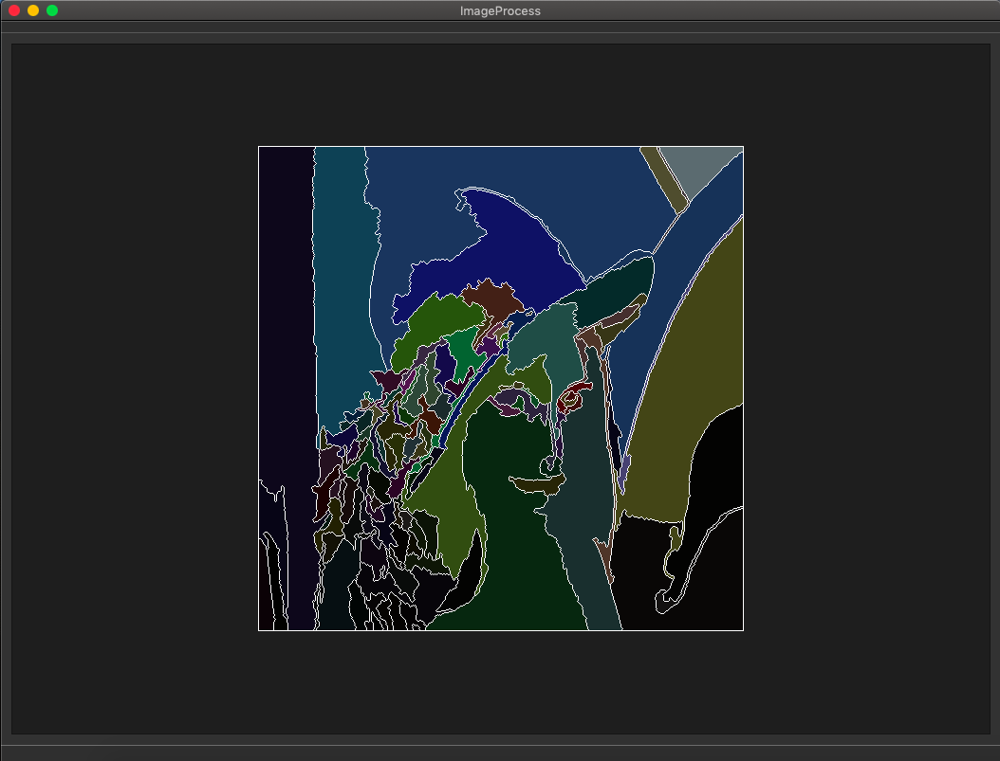
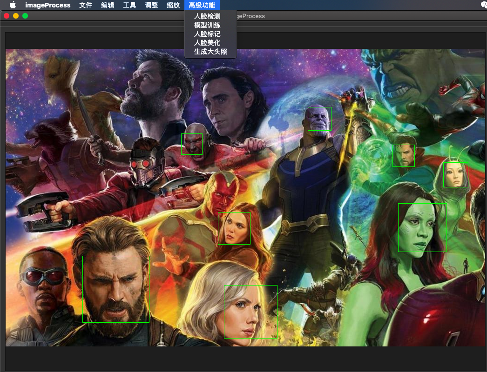

# 周名弦的个人报告

## 目录
- [周名弦的个人报告](#周名弦的个人报告)
    - [分工任务](#分工任务)
        - [第0轮迭代](#第0轮迭代)
            - [设计思路](#第0轮迭代)
            - [解决方案](#第0轮迭代)
            - [运行效果图](#第0轮迭代)
        - [第1轮迭代](#第1轮迭代)
            - [设计思路](#第1轮迭代)
            - [解决方案](#第1轮迭代)
            - [运行效果图](#第1轮迭代)
        - [第2轮迭代](#第2轮迭代)
            - [设计思路](#第2轮迭代)
            - [解决方案](#第2轮迭代)
            - [单元测试](#第2轮迭代)
            - [运行效果图](#第2轮迭代)
        - [第3轮迭代](#第3轮迭代)
            - [设计思路](#第3轮迭代)
            - [解决方案](#第3轮迭代)
            - [运行效果图](#第3轮迭代)
    - [心得体会](#心得体会)
    - [课程建议](#课程建议)

## 分工任务

- 我作为本项目的组员之一，在项目中主要负责了项目的基本功能的实现，在MVVM框架下与小组成员合作。
- 在第0轮迭代中，我负责主持程序主题的选择，进行需求分析的讨论与完善，确定了要完成的图像处理软件的基本功能，并参与部分MVVM框架的搭建，实现了图片打开的功能。
- 在第1轮迭代中，我负责了View层，实现相关命令的获取调用以及相关界面的修改。
- 在第2轮迭代中，我负责Model层和ViewModel层。完成了转化为灰度图、二值化、图像分割、边缘检测、直方图均值化、加噪声、去雾、锐化、放大缩小等功能的底层实现。
- 在第3轮迭代中，我负责APP层，将ViewModel层的命令与View层连接起来。

### 第0轮迭代

#### 设计思路

- 本轮迭代是后续迭代的基础，为了小组成员之后的高效合作，主要的工作有：

    1. 进行小组分工
    2. 选择协助平台并创建项目仓库
    3. 选择合适的程序主题
    4. 讨论具体的需求、功能和初步的实现思路
    5. 基本完成MVVM框架的搭建
    6. 了解、尝试编写MVVM框架下的简单程序

经过详细的讨论和选择，我们最终决定开发一个图像处理软件，能够针对给定的图像进行一系列处理操作，实现基本的图像功能（包括图像的打开、保存、缩放、撤销操作、亮度对比度调节等），还要实现一部分扩展功能（包括各种滤镜、边缘检测、人脸识别、人脸标注等）。由此我们对自己的产品进行了需求分析，总结了实现的思路。

之后我们在自己的探索和老师的指导下，正确地搭建好了MVVM框架，完成了后续迭代的最基础部分，实现了小组成员之间高效合作的可能。

在本轮迭代中，我们首先实现了最简单的打开并显示图像的功能。我们为图像设计了一个专门的类，之后的操作就都是针对该类的操作，即我们的Model层实际上是调用类方法。

经过讨论，为了实现撤销的操作，我们决定维护一个存放该类的可变长数组的数据结构。

#### 解决方案

- 首先我们以github作为搭建仓库的平台。我初步熟悉了Github的命令和操作方式，与小组成员对仓库进行了创建、共享等基本操作。

- 我们决定使用Travis这个持续集成工具，对helloworld.c这个样例程序在github仓库中进行维护。

- 我们在老师的指导下开始了MVVM模型的搭建。我们选择了Qt为图形库进行图形界面的开发。由于各个组员的操作系统几乎包括了全平台（Windows + Ubuntu + MacOS），我们的程序需要有良好的平台兼容性。在搭建MVVM模型的过程中，老师数次指出了我们的框架的问题所在，指出理解不够到位的地方。经过多次整改，我们终于设计完成了模型整体的架构，将各个模块分离开来，使得大家可以各司其职，并行完成开发任务，也对MVVM架构有了更深刻的理解，能够理解各个模块之间的联系以及相互通信的方式。如此架构写好之后，增加功能就变得很简单，可以各司其职，增加功能函数和相应command，并绑定好即可增添一个新功能，可维护性极高。

- 我们引入了OpenCV库，底层的部分操作将直接调用库函数实现。

```c++
void Image::toGray(){
    cv::cvtColor(image,image,cv::COLOR_RGB2GRAY);
}
```

- 为实现对图像的操作的撤销与恢复，我们实现了一个ImageList类，存储用户的操作历史。

```c++
    class ImageList
    {
    private:
        std::vector<Image> image_list;
    public:
        ImageList();
        ~ImageList();
        Image getImage();
        void addImage(const Image& image);
        void deleteImage();
        void clearList();
        bool empty();
    };
```

#### 运行效果图


### 第1轮迭代

#### 设计思路

在第0轮迭代中，我们成功搭建MVVM框架，在小组成员熟悉该框架后就开始正式地合作开发。第1轮迭代实现了调节亮度对比度的功能、各种滤波的功能以及保存图像和撤销的功能。本轮迭代中我负责View层，View层需要给出获得ViewModel层命令的相关接口以及相应的界面功能选项的添加。

在开发过程中，我对于Qt库有了一定程度的掌握，在View层主要遇到的困难有，槽函数的链接，QTgraphicsView中鼠标的监听，以及下拉槽界面的设计。和ViewModel的通信和传参则是另一个难点，针对每一个新功能，我们都需要设计一条新命令，然后绑定共享指针以便Model修改之后将通知通过Viewmodel传送到View做相应的update。

我们在View层的源代码中加入从属于Qwidget的操作函数（Command），通过Qt的信号槽机制，绑定菜单栏的对应栏目和相关的Command指令，使得用户能够点击菜单中的条目来输入参数，并通过回调这些参数值来传递给Command对应的指令。从而即便View层不直接和Model交互，也能通过命令的方式调用。View层需要暴露出接受Command的接口，与App中相关的Command连接。

对于UI设计，需要考虑到整个软件的图形界面排版，以及菜单栏条目的分布，树状结构的合理安排等，对于模块化设计和框架优化等内容进行改进。

对于GUI组件及其实现，有一些细微的注意点，如：

直接通过QTdesigner添加菜单，对每一个条目都添加QAction，对于每一个QACtion，要修改其名字，再转到槽函数，即可得到一个声明为on_#name_triggerd的函数，实现函数体即可。用QTdesigner设计了button之后，也一定要记得更改button的名字，以及button上显示的文本。

#### 解决方案

```c++
class MainWindow : public QMainWindow
{
    Q_OBJECT

public:
    explicit MainWindow(QWidget *parent = nullptr);
    void update();
    void error(const QString &content);
    void setQImage(std::shared_ptr<QImage> qImage);
    ~MainWindow();
    void setDisplayNowCommand(std::shared_ptr<Command> displayNowCommand);
    void setOpenFileCommand(std::shared_ptr<Command> openFileCommand);
    void setSaveFileCommand(std::shared_ptr<Command> saveFileCommand);
    void setAverBlurCommand(std::shared_ptr<Command> averBlurCommand);
    void setMidBlurCommand(std::shared_ptr<Command> midBlurCommand);
    void setGaussBlurCommand(std::shared_ptr<Command> gaussBlurCommand);
    void setBilaterBlurCommand(std::shared_ptr<Command> bilaterBlurCommand);
    void setLightContrastCommand(std::shared_ptr<Command> lightContrastCommand);
    void setTmpLightContrastCommand(std::shared_ptr<Command> tmpLightContrastCommand);
    ...
    void setUndoCommand(std::shared_ptr<Command> undoCommand);
    ...
    std::shared_ptr<Notification> getNotification();
private slots:

    void on_actionopen_triggered();

    void on_actionsave_triggered();

    void on_actionToGray_triggered();

    void on_actionToBinary_triggered();

    void on_actionlight_triggered();

    void on_actionjizhilvbo_triggered();

    void on_actionzhongzhillvbo_triggered();

    void on_actiongaosilvbo_triggered();

    void on_actionshuangbianlvbo_triggered();

    ...

    void on_actionchexiao_triggered();

private:
    Ui::MainWindow *ui;
    std::shared_ptr<QImage> qImage;
    QGraphicsView* graphView;
    QGraphicsScene *scene;
    QMenu *tool_item;
    QMenu *adjust_item;
    QMenu *enlarge_item;
    ...
    LightConstractDialog lightDialog;

    std::shared_ptr<UpdateNotification> updateNotification;
    std::shared_ptr<Command> openFileCommand;
    std::shared_ptr<Command> saveFileCommand;
    std::shared_ptr<Command> toGrayCommand;
    std::shared_ptr<Command> toBinaryCommand;
    std::shared_ptr<Command> averBlurCommand;
    std::shared_ptr<Command> midBlurCommand;
    std::shared_ptr<Command> gaussBlurCommand;
    std::shared_ptr<Command> bilaterBlurCommand;
    ...
    std::shared_ptr<Command> undoCommand;
};
```

```c++
void MainWindow::setSaveFileCommand(std::shared_ptr<Command> saveFileCommand)
{
    this->saveFileCommand = saveFileCommand;
}

...

void MainWindow::on_actionsave_triggered()
{
    QString fileName = QFileDialog::getSaveFileName(this);
    if(fileName.isEmpty())
    {
        return;
    }
    else
    {
        saveFileCommand->setParameter(fileName.toStdString());
        if(!saveFileCommand->exec())
        {
            error("文件保存失败!");
        }
    }
}
```

#### 运行效果图


### 第2轮迭代

#### 设计思路

在本轮迭代中我负责Model以及ViewModel层，完成了转化为灰度图、二值化、图像分割、边缘检测、直方图均值化、加噪声、去雾、锐化、放大缩小等功能的实现。

对于上述各种功能，我们主要使用了opencv的各种库函数，以及一部分我们自己根据相关算法实现的函数。

- 首先，对于各模块之间的通信，当在界面上进行一次操作：

    1. View调用ViewModel中的方法，发出Command。
    2. ViewModel对应的Command调用Model中对应的函数对数据进行处理。
    3. Model处理完成后通过Notification通知ViewModel更新数据。
    4. ViewModel数据更新后发出Notification通知View层重新绘制界面。

ViewModel层暴露了命令接口给View层，由APP层负责连接，ViewModel负责调用Model中的相关操作。Model层在执行完相关操作后需要一个Notification来通知View层的改变，由于Model层与View层并不发生直接联系，因此先通知ViewModel层，数据的转化操作在ViewModel层进行执行。

为了实现View层的开发不受限于ViewModel层的接口，我们设计了Command基类，规范了调用的方式，通过在ViewModel中生产出相关操作的Command派生类，以Command基类的方式暴露出去，以此来方便View层的调用。Command派生类的具体实现由ViewModel和Model层来负责，内部实现实际上是调用了ViewModel中的相关接口。

Model类中处理的图像信息以OpenCV中的Mat数据结构储存，然后调用类中的成员函数进行各种方法的处理。在每一次处理结束都要通知ViewModel以便ViewModel再通知View来更新界面。在Model类中还保存了一个中间的图像信息newImage，存储在ImageList中。每次在调用不同的成员函数进行处理后，先把当前显示的图像信息即newImage存入ImageList，每次在新的操作中都是对ImageList通过getImage()方法得到的栈顶图像进行操作，这样就可以实现连续撤销操作。

在逐渐熟悉MVVM模式以后，就能进行流水化作业，能直接使用框架进行功能的添加，只需要在Command中添加相应的类，并与Viewmodel相连，然后ViewModel可以调用Model中的方法，而不需要考虑View层的操作，这样使得功能的叠加更加便捷，体现出了MVVM模式的优点。

#### 解决方案

ViewModel

```c++
class ViewModel
{
private:
    std::shared_ptr<ImageSegmentationCommand> imageSegmentationCommand;
    ...

public:
    ...
    std::shared_ptr<Command> getImageSegmentationCommand();
    ...
    bool imageSegmentation(int& threshold);
    ...
};
```

```c++
class ImageSegmentationCommand: public Command
{
private:
    // Command负责发送指令给ViewModel
    // ViewModel类似于控制器Controller的作用
    ViewModel* viewModel;
    int threshold;
public:
    ImageSegmentationCommand(ViewModel* view_model);
    ~ImageSegmentationCommand();
    void setParameter(std::any params);
    bool exec();
};
```

```c++
ImageSegmentationCommand::ImageSegmentationCommand(ViewModel* view_model) : viewModel(view_model)
{
    // nothing
}

ImageSegmentationCommand::~ImageSegmentationCommand()
{
    // nothing
}

bool ImageSegmentationCommand::exec()
{
    return viewModel->imageSegmentation(threshold);
}

void ImageSegmentationCommand::setParameter(std::any params)
{
    threshold= *std::any_cast<int>(&params);
}
```

Model

```c++
bool Model::imageSegmentation(int &threshold){
    if(imageList->empty())
        return false;
    Image newImage=imageList->getImage();
    if(newImage.empty())
        return false;
    if(!newImage.checkColor())
        return false;
    newImage.imageSegmentation(threshold);
    imageList->addImage(newImage);
    notification->notify();
    return true;
}
```

例如图像分割的实现，我们看到ViewModel中含有派生类ImageSegmentationCommand的私有变量，而暴露出去的接口是基类Command，因此View层无需知道具体的命令如何命名，由于Command有统一规范的接口，View层只需要直接调用即可。

#### 单元测试

```c++
#include <iostream>
#include "Model.h"
int main()
{
  Model model;
  string file_name;
  cin >> file_name;
  model.openImage(file_name);
  model.imageSegmentation(50);
  model.undo();
  model.toGray();
  model.toBinary(100);
  model.undo();
  model.grayEqualizeHist();
  model.undo();
  model.undo();
  model.detectEdge(30);
  model.colorEqualizeHist();
  model.imageDefog();
  model.logEnhance();
  model.undo();
  model.undo();
  model.undo();
  model.laplace();
  model.addGaussNoise();
  model.undo();
  model.undo();
  model.addSaltNoise(3000);
  model.undo();
  model.imageEnlarge();
  model.imageReduct();
  model.gammaCorrect(3.0f);
  model.imageGuided(0.02f*255*255);
  model.undo();
  model.undo();
  model.undo();
  model.undo();
  model.undo();
  model.undo();
  return 0;
}
```

#### 运行效果图




### 第3轮迭代

#### 设计思路

第3轮迭代在第2轮的基础上增加一些高级功能比如说人脸识别、人脸标记、人脸美化、生成大头照等，主要是训练了模型并加入到我们的软件中。本轮迭代中我负责APP层，将ViewModel层的命令与View层连接起来。APP层的重要性在于将View和ViewModel层联系起来，使View层能够通过给ViewModel层发消息，来给绑定的Model层发消息。

- 在APP层我们实现了：

    1. ViewModel层绑定Model层
    2. View绑定ViewModel中的数据
    3. View绑定所需命令
    4. ViewModel绑定Notification

在MVVM框架中，View层只需要调用ViewModel暴露的接口，而View层中并不存放ViewModel的实体，需要获取ViewModel层暴露的命令，于是App层需要负责的是两者的连接。该层实际上需要进行的操作比较简单，只需分别调用View层和ViewModel层暴露出的接口即可。

#### 解决方案

```c++
ImageApp::ImageApp() : view(std::make_shared<MainWindow>()), model(std::make_shared<Model>()), viewModel(std::make_shared<ViewModel>())
{
    // view model绑定model
    viewModel->setModel(model);
    // view绑定view model中的数据
    view->setQImage(viewModel->getQImage());
    // view绑定命令
    ...
    view->setTrainModelCommand(viewModel->getTrainEigenModelCommand());
    view->setDetectFacesCommand(viewModel->getDetectFacesCommand());
    view->setAnnotateFacesCommand(viewModel->getAnnotateFacesCommand());
    view->setBeautifyFacesCommand(viewModel->getBeautifyFacesCommand());
    view->setGenerateHeadshotsCommand(viewModel->getGenerateHeadshotsCommand());
    ...
    // view model绑定notifiacation
    viewModel->setUpdateNotification(view->getNotification());
}
```

#### 运行效果图




## 心得体会

- 该项目让我第一次经历正式的团队协作开发软件流程，使用现代化的工具有助于团队协作提升效率。Github代码托管方便我们进行代码的版本控制，MVVM架构能够让我们同时进行多个模块的代码编写，Travis可以减轻我们集成工作的负担。在本次工程的开发工程中，我基本熟悉了团队开发软件的流程，能够在团队中高效工作，贡献代码。

- 经过指导和联系，我们小组认识并实践了MVVM框架，认识了其中的难点重点，也体会到了其带来的好处——高效的并行开发。MVVM框架下，底层代码实现与界面实现分离，这就大大降低了模块间的耦合程度，提高并行开发效率。

- 作为一名程序员，我认识到应该时刻关注相关领域的最新发展，例如对于C++语言的新标准等，应该尽快尽可能了解、学习并掌握。

## 课程建议

- 希望老师在讲解MVVM框架的时候能够给出其他历届学生一些比较优秀的设计范例，可以针对某一特定功能的实现详细讲解View/Model/ViewModel层分别扮演了什么角色，从而指导小组团队如何实现协作开发。

- 对于持续集成等团队协作开发工具，希望老师能够给出一些参考资料等，以方便我们更透彻地理解。
