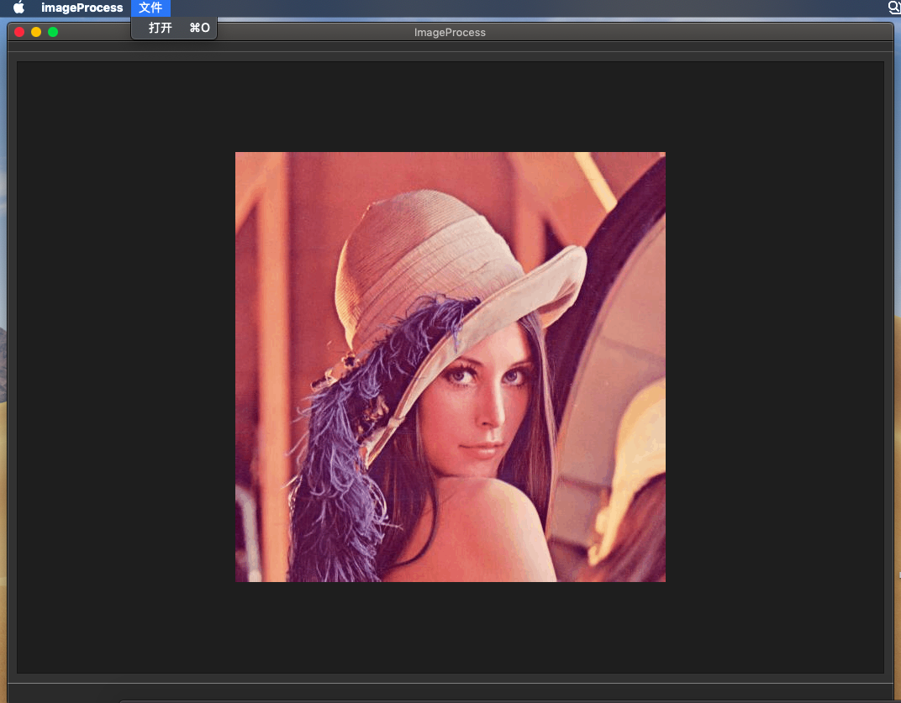

# 梁超的个人报告

## 目录
- [梁超的个人报告](#梁超的个人报告)
    - [分工任务](#分工任务)
        - [第0轮迭代](#第0轮迭代)
            - [设计思路](#第0轮迭代)
            - [解决方案](#第0轮迭代)
            - [运行效果图](#第0轮迭代)
        - [第1轮迭代](#第1轮迭代)
            - [设计思路](#第1轮迭代)
            - [解决方案](#第1轮迭代)
            - [单元测试](#第1轮迭代)
            - [运行效果图](#第1轮迭代)
        - [第2轮迭代](#第2轮迭代)
            - [设计思路](#第2轮迭代)
            - [解决方案](#第2轮迭代)
        - [第3轮迭代](#第3轮迭代)
            - [设计思路](#第3轮迭代)
            - [解决方案](#第3轮迭代)
            - [运行效果图](#第3轮迭代)
        - [相关类图](#相关类图)
    - [心得体会](#心得体会)
    - [课程建议](#课程建议)

## 分工任务

- 我作为本项目的组长，统筹了组员的工作。
- 在第0轮迭代中，我负责搭建持续集成的服务以及MVVM框架。
- 在第1轮迭代中，我负责Model和ViewModel层，完成撤销、保存、调节亮度对比度、各种滤波功能的底层实现。
- 在第2轮迭代中，我负责APP层，将ViewModel层的命令与View层连接起来。
- 在第3轮迭代中，我负责View层，实现相关命令的获取调用以及相关界面的修改。

### 第0轮迭代

#### 设计思路

由于后续的迭代都是在此基础上的，因此我希望先正确地搭建好MVVM框架，以便我们小组成员之后的高效合作。

在本轮迭代中，我们希望能够先实现最简单的打开显示图像的功能。我们为图像设计了一个专门的类，因为我们希望之后的所有操作都是针对于该类的操作，也就是说我们的Model层实际上是调用类方法。此外我们维护了一个存放该类的可变长数组的数据结构，这是为了方便之后撤销操作的实现。

#### 解决方案

由于我们引入了OpenCV库，因此底层的一些操作我们将直接调用库函数来实现。

```c++
void Image::openImage(const std::string &file_path)
{
    image = cv::imread(file_path);
}
```

#### 运行效果图




### 第1轮迭代

在本轮迭代中我负责Model以及ViewModel层，主要实现保存、撤销、调节亮度对比度、各种滤波等功能。

#### 设计思路

ViewModel层主要负责暴露命令接口给View层，由APP层负责连接，ViewModel负责调用Model中的相关操作。Model层在执行完相关操作后需要一个notification来通知View层的改变，由于Model层与View层并不发生直接联系，因此首先通知ViewModel层，对于数据的转化操作可以在ViewModel层进行执行。

为了使View层的开发不受限于ViewModel层的接口，我们设计了Command基类，规范了调用的方式，通过在ViewModel中生产出相关操作的Command派生类，以Command基类的方式暴露出去，以此来方便View层的调用。Command派生类的具体实现由ViewModel和Model层来负责，内部实现实际上是调用了ViewModel中的相关接口。

对于撤销操作来说，由于我们维护了一个可变长数组来模拟栈，因此撤销操作实际上是一个栈弹出的操作。而调节亮度对比度的操作实际上是对图像的像素点进一个线性算子$ax+b$的运算，对图像进行处理。对于各种滤波功能的实现，我们调用了OpenCV的相关库函数。

#### 解决方案

```c++
class UndoCommand : public Command
{
private:
    // Command负责发送指令给ViewModel
    // ViewModel类似于控制器Controller的作用
    ViewModel* viewModel;
public:
    UndoCommand(ViewModel* viewModel);
    ~UndoCommand();
    void setParameter(std::any params);
    bool exec();
};
```

```c++
class ViewModel
{
private:
    std::shared_ptr<UndoCommand> undoCommand;
    ...

public:
    ...
    std::shared_ptr<Command> getUndoCommand();
    ...
    bool undo();
    ...
};
```

例如撤销操作的实现，我们看到ViewModel中含有派生类UndoCommand的私有变量，而暴露出去的接口是基类Command，因此View层无需知道具体的命令如何命名，由于Command有统一规范的接口，View层只需要直接调用即可。

#### 单元测试

```c++
#include <iostream>
#include "Model.h"
int main()
{
  Model model;
  string file_name;
  cin >> file_name;
  model.openImage(file_name);
  model.changeImageLightContrast(3, 40);
  model.undo();
  model.changeImageLightContrast(30, 45);
  model.averBlur();
  model.midBlur();
  model.gaussBlur();
  model.undo();
  model.undo();
  model.undo();
  model.undo();
  model.undo();
  model.undo();
  return 0;
}
```

#### 运行效果图


### 第2轮迭代

在本轮迭代中我负责APP层，主要实现View和ViewModel之间命令的连接。

#### 设计思路

我们知道Model层对于View层来说是透明的，因此View层只需要调用ViewModel暴露的接口，而View层中并不存放ViewModel的实体，需要获取ViewModel层暴露的命令，于是App层需要负责的是两者的连接。该层实际上需要进行的操作比较简单，只需分别调用View层和ViewModel层暴露出的接口即可。

#### 解决方案

```c++
ImageApp::ImageApp() : view(std::make_shared<MainWindow>()), model(std::make_shared<Model>()), viewModel(std::make_shared<ViewModel>())
{
    // view model绑定model
    viewModel->setModel(model);
    // view绑定view model中的数据
    view->setQImage(viewModel->getQImage());
    // view绑定命令
    ...
    view->setToGrayCommand(viewModel->getToGrayCommand());
    view->setToBinaryCommand(viewModel->getToBinaryCommand());
    view->setDetectEdgeCommand(viewModel->getDetectEdgeCommand());
    view->setGrayEqualizeHistCommand(viewModel->getGrayEqualizeHistCommand());
    view->setColorEqualizeHistCommand(viewModel->getColorEqualizeHistCommand());
    view->setLaplaceCommand(viewModel->getLaplaceCommand());
    view->setLogEnhanceCommand(viewModel->getLogEnhanceCommand());
    view->setGammaCorrectCommand(viewModel->getGammaCorrectCommand());
    view->setAddGaussNoiseCommand(viewModel->getAddGaussNoiseCommand());
    view->setAddSaltNoiseCommand(viewModel->getAddSaltNoiseCommand());
    view->setImageSegmentationCommand(viewModel->getImageSegmentationCommand());
    view->setImageEnlargeCommand(viewModel->getImageEnlargeCommand());
    view->setImageReductCommand(viewModel->getImageReductCommand());
    view->setImageGuidedCommand(viewModel->getImageGuidedCommand());
    view->setImageDefogCommand(viewModel->getImageDefogCommand());
    view->setGenerateHeadshotsCommand(viewModel->getGenerateHeadshotsCommand());
    // view model绑定notifiacation
    viewModel->setUpdateNotification(view->getNotification());
}
```


### 第3轮迭代

本轮迭代中我负责View层，View层需要给出获得ViewModel层命令的相关接口以及相应的界面功能选项的添加。

#### 设计思路

View层由于不直接和Model交互，因此其调用是通过命令的方式。View层需要暴露出接受Command的接口，在APP层中获取相关的Command的连接。具体实现上，我们使用了Qt提供的信号槽的方式，在信号槽中按照Command的调用规范进行相关的调用。

#### 解决方案

```c++
void MainWindow::setTrainModelCommand(std::shared_ptr<Command> trainModelCommand){
    this->trainEigenModelCommand=trainModelCommand;
}
...
void MainWindow::on_actionTrainEigenModel_triggered()
{
    QString datapath = QFileDialog::getExistingDirectory(this);
    if(datapath.isEmpty())
    {
        return;
    }
    else
    {
        trainEigenModelCommand->setParameter(datapath.toStdString());
        trainEigenModelCommand->exec();
    }
}
...
```

#### 运行效果图


### 相关类图


## 心得体会

- 通过本次课程，我们掌握了团队协作开发的必要工具链，尽管前期我们投入了一定的时间学习熟悉工具链的使用，但不得不说这对于我们高效的合作提供了非常大的帮助。
- 在实践过程中，我们一开始搭建的框架，以为已经是符合规范的MVVM框架，但是在老师的指正下，我们发现原有的框架仍然有非常紧密的耦合问题，于是我们不断地修改一些错误的设计，最终成功搭建了比较规范的MVVM框架，在这个框架下，我们的配合显得比较自然，因此，我们在团队协作完成一个项目时，框架的设计十分重要，如果我们选对了框架，并且成功做出了第一个版本的demo，那么在后续的更多功能的开发中，便会游刃有余。

## 课程建议

- 希望老师在讲解MVVM框架的时候能够给出比较优秀的简单设计范例，可以针对某一个功能的实现讲明白View/Model/ViewModel层分别干了什么，如何实现协作开发。
- 对于持续集成，希望老师能够给出一些参考资料。